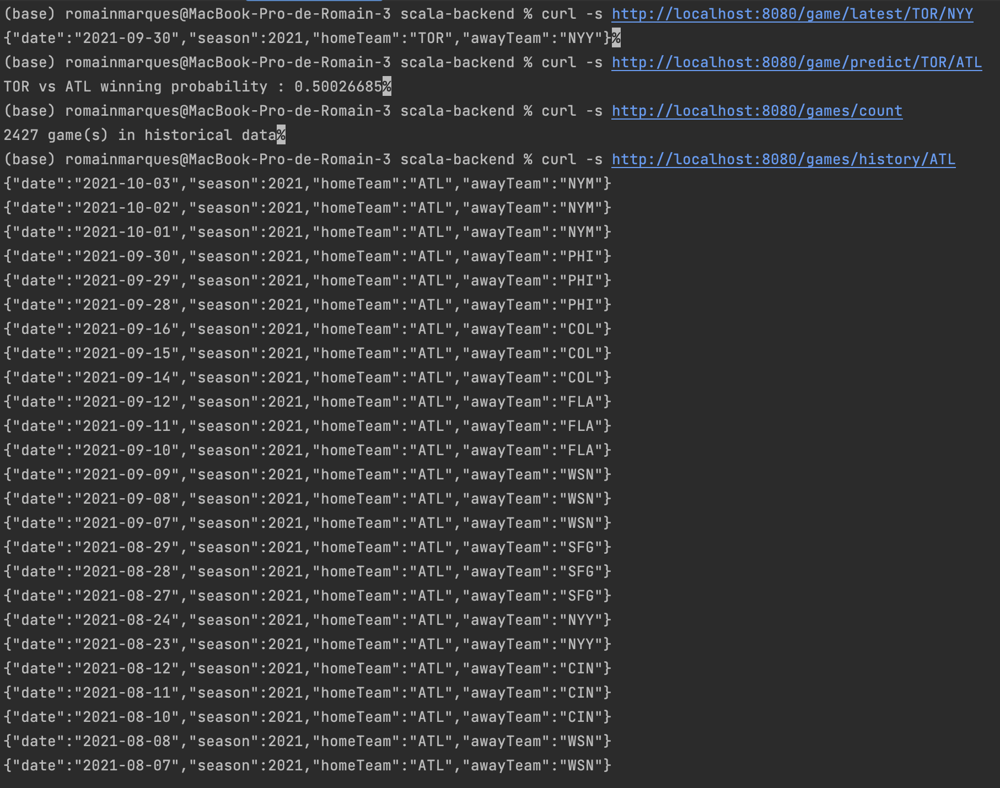

## sbt project compiled with Scala 3

### Usage

This is a normal sbt project. You can compile code with `sbt compile`, run it with `sbt run`, and `sbt console` will start a Scala 3 REPL.

For more information on the sbt-dotty plugin, see the
[scala3-example-project](https://github.com/scala/scala3-example-project/blob/main/README.md).

### Documentation

#### Implementation

For the endpoints, we implemented :
- predict
- history

We created a class Prediction to store the prediction of a match between two teams.

#### File *MlbApi.scala*

- We created a method ```allGameResponse``` in order to print a list of games of a team. It is useful to print the history of all the matches.

- We also created a method ```initDB``` to initialize the database with the data of the file. If you want to launch the project, it is necessary to modify the path of the file. 
The method reads the file, then gets the adds to the table predictions and games the needed values. Finally, it calls the two methods to add values in the table.

- We created a method ```transformElement``` to parse a string we got from the file into an ```Element```. There is more details
in the section ``Element.scala`` below.

- We modified the function ```insertGames``` in order to insert the values in the table games, which is useful for the history of the matches, to count them,etc.
Same with the function ```insertPredictions``` for the table predictions.

- We created a function ```getAllGamesOfHomeTeam``` to access the database and get all the games of a team.

- We also created a request ```getProbaWinTeam``` to get the informations of the table predictions of a match between the hometeam 
and the awayTeam. Thanks to this informations, we can calculate the probability of the hometeam to win the match, work which is done in the class Prediction.

- Finally, we created a function ```selectEverything``` to get all the informations of the table games.

#### File *Element.scala*

The file ``Element.scala`` contains only a case class with the Prediction and the Game class as attributes.

We decided to create it for the reading of the file. Thanks to it, after the reading is complete, with have a list of ``Element``
which is composed of all the Games and Predictions we need for the endpoints.

So, when we read a line of the csv, we create a new ``Element`` with the infos required thanks to the function ``transformElement``.

#### File *Prediction.scala*

The file ``Prediction.scala`` is used for the predictions. It contains all the attributes we decided were useful for the predictions.

Our prediction is made in the private function ``mean`` and can be called publicly in the function ``homeTeamWinningProb``.

It returns a value between 0 and 1 for the probability with the hometeam winning. We just compare the elo of the two teams.


### Tests

In order to test the project, you can launch the following requests:
# Before launching the project and the requests, be sure to modify the path of the file in MlbApi.scala, line 55!

```sh
curl -s http://localhost:8080/game/latest/TOR/NYY
curl -s http://localhost:8080/game/predict/TOR/ATL
curl -s http://localhost:8080/games/count  
curl -s http://localhost:8080/games/history/ATL
```

As a proof of each commands work, you can see the picture ``RequestResults.png`` in the folder or see it below :



We didn't do unit tests such as in the first project as it was more complicated to do it with the database.
Indeed, most of the functions we created are using the database, so we would have to mock the database, which is not easy to do, 
especially in scala. Moreover, we also had to simulate the launching of the project in order to read the file.

We know that it is not optimal to test the project like this, but we didn't find a better solution with the time we had.